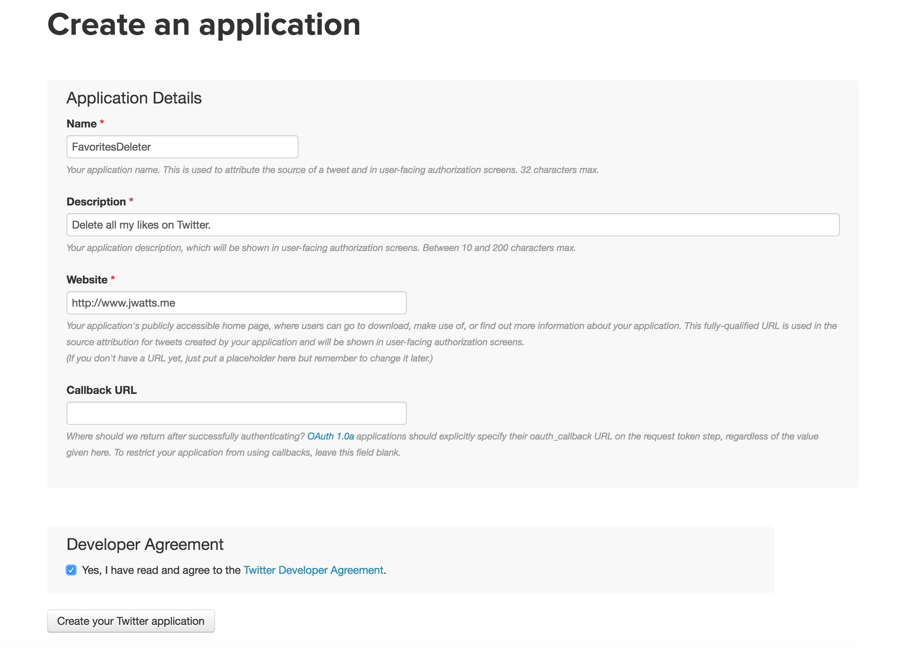

# Twitter Unliker

A simple python script that will unlike every tweet you've ever liked for free. Just input your security credentials and let it run!

## Requirements

This script depends on the [python-twitter](https://github.com/bear/python-twitter) library. You might run `pip install python-twitter` to install this library. This was tested under Python 2.7.

## Usage

To use this application, first create a Twitter application by signing in at apps.twitter.com.

Then go to the "Keys and Access Tokens" tab, scroll down to "Your Access Token" and generate your access token. Then, you will find your access token, access token secret, consumer key, and consumer key secret that you will need to login with the script. Copy these values into the `twitter.Api` constructor call of `main.py`.

Once you have followed the steps above, just run the `main.py` script with a python interpreter.
